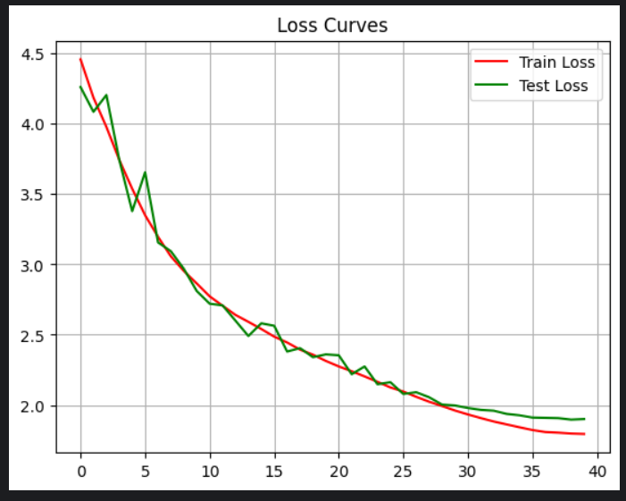
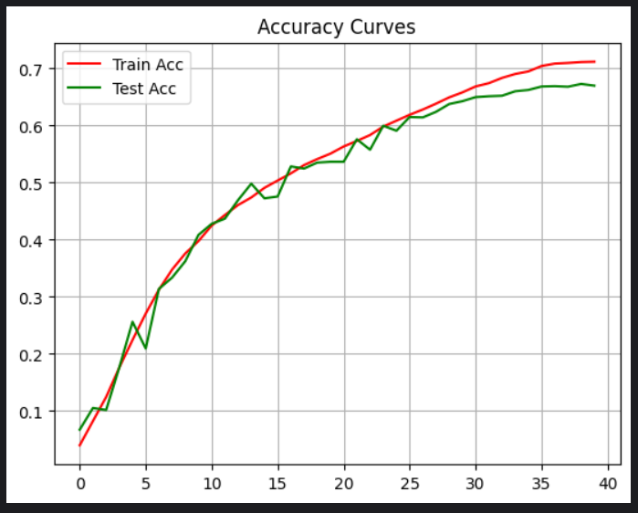
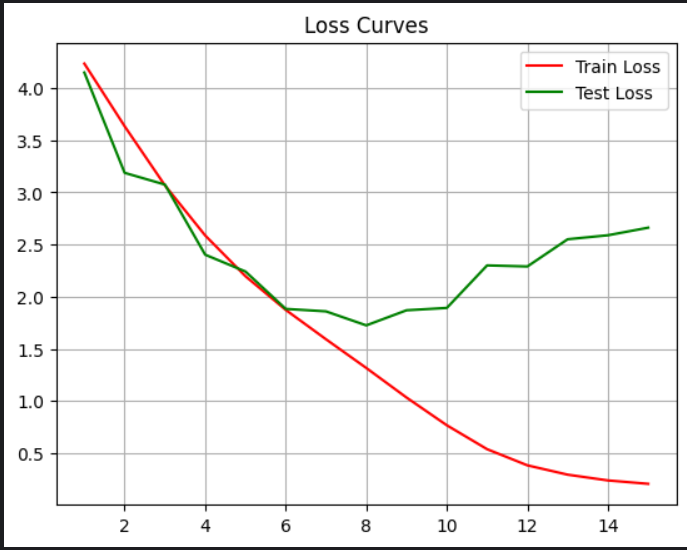
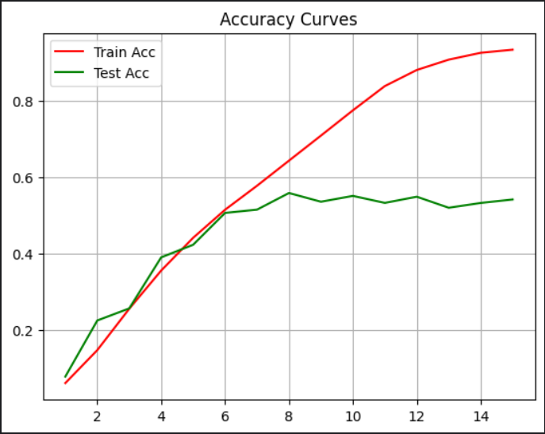

# ResNet-34 from Scratch — Food101 (DDP)

ResNet-34 implemented from scratch (paper: [Deep Residual Learning for Image Recognition](https://arxiv.org/abs/1512.03385))
and trained on [Food101](https://data.vision.ee.ethz.ch/cvl/datasets_extra/food-101/) (101 classes,
101,000 images) with `DistributedDataParallel` across all available GPUs on a single node.

**Why from scratch, not `torchvision.models.resnet34`?** The point of this repo is the implementation
itself — the residual block, the identity-vs-projection skip logic, and a correct multi-GPU training
loop — as a demonstration of understanding the paper rather than calling a pretrained model.

## Results

| Metric | Value |
|---|---|
| Model | ResNet-34 (from scratch, no pretraining) |
| Parameters | 21,336,485 (~21.3M) |
| Dataset | Food101 (75,750 train / 25,250 test) |
| Epochs | 40 |
| Final test accuracy | 66.99% |
| Final test loss | 1.9008 |
| Hardware | 2x NVIDIA T4 (Kaggle) |

### Training Time Benchmark (15 Epochs)

| Configuration | Epochs | Time | Speedup |
|---|---|---|---|
| Single GPU | 15 | 3h 38m 12s | 1.00x |
| Dual GPU (DDP) | 15 | 1h 21m 35s | ~2.67x |

## Structure

| File                   | Purpose                                                               |
|------------------------|-----------------------------------------------------------------------|
| `model_builder.py`     | `ResBlock` and `ResNet` architecture                                  |
| `data_setup.py`        | Food101 dataset/transform construction and distributed dataloaders    |
| `distributed_utils.py` | Process group setup/teardown, seeding                                 |
| `engine.py`            | `train_step`, `test_step`, and the epoch loop (DDP-aware metric sync) |
| `train.py`             | Entry point: launches training across GPUs via `mp.spawn`             |
| `predict.py`           | Loads a checkpoint and visualizes predictions on the test set         |
| `utils.py`             | Checkpoint save/load, loss and accuracy curve plotting                |
| `tests/test_model.py`  | Unit tests for architecture correctness (shapes, params, skip logic)  |

## Usage

```bash
pip install -r requirements.txt

# Train (spawns one process per visible GPU)
python train.py

# Train with custom hyperparameters
python train.py --epochs 30 --learning-rate 5e-4 --weight-decay 5e-5 --batch-size 64

# Plot results
python -c "import torch, utils; utils.plot_curves(torch.load('training_results.pth'))"

# Run inference on random test samples
python predict.py

# Run the unit tests
pytest tests/ -v
```

Training produces `resnet34_food101.pth` (model weights) and `training_results.pth` (per-epoch
loss/accuracy history) in the working directory.

### `train.py` arguments

| Argument              | Default                     | Description                               |
|-----------------------|-----------------------------|-------------------------------------------|
| `--epochs`            | `15`                        | Number of training epochs                 |
| `--learning-rate`     | `0.001`                     | Adam learning rate                        |
| `--weight-decay`      | `1e-4`                      | Adam weight decay                         |
| `--batch-size`        | `32`                        | Per-GPU batch size                        |
| `--label-smoothing`   | `0.1`                       | Label smoothing for `CrossEntropyLoss`    |
| `--eta-min`           | `1e-6`                      | Minimum LR for the cosine scheduler       |
| `--seed`              | `42`                        | Base random seed (offset by rank)         |
| `--data-root`         | `data`                      | Food101 download/cache directory          |
| `--checkpoint-path`   | `resnet34_food101.pth`      | Where to save model weights               |
| `--results-path`      | `training_results.pth`      | Where to save the metrics history         |

### `predict.py` arguments

| Argument              | Default                     | Description                     |
|-----------------------|-----------------------------|---------------------------------|
| `--checkpoint-path`   | `resnet34_food101.pth`      | Model weights to load           |
| `--data-root`         | `data`                      | Food101 download/cache directory|
| `--rows`, `--cols`    | `4`, `4`                    | Prediction grid size            |


## Loss and Accuracy curves after running the model for 40 epochs



## Loss and Accuracy curves: 15 epochs without weight decay and lr-scheduling



## License

[MIT](LICENSE)
